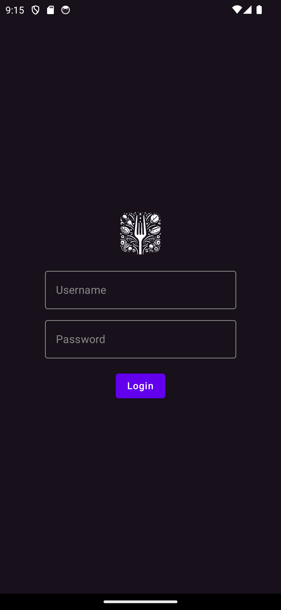
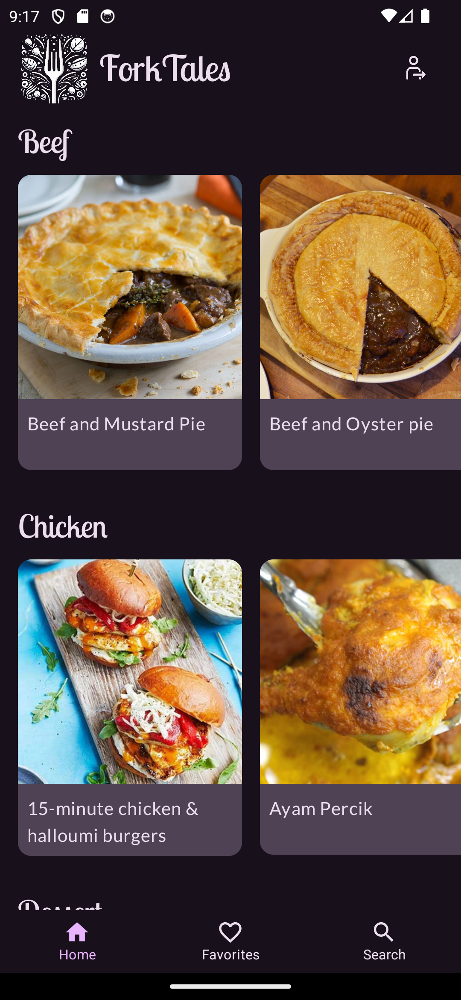
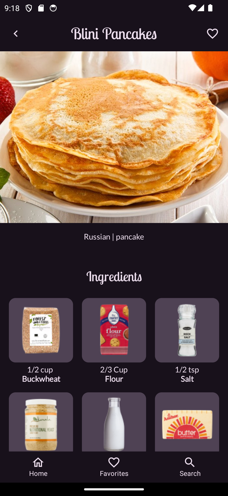
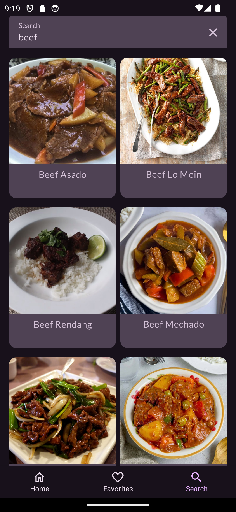

# ForkTales Mobile Application

This project is a mobile application developed for a mobile application development course. The application is built using Kotlin and Android Studio, and it utilizes modern Android development tools and libraries such as Jetpack Compose for UI, Retrofit for network requests, and Room for local database management.

## Screenshots

  
   
  
  

## API Used

The application fetches data from [TheMealDB API](https://www.themealdb.com/api.php). This API provides a wide range of information about various recipes, including details like ingredients, instructions, and images.

## Features

- Browse recipes by category
- View detailed information about each recipe
- Save favorite recipes for easy access
- Search for recipes

## Login Information

The login functionality in this application is hardcoded for demonstration purposes. To log in to the application, use the following credentials:

- Username: admin
- Password: admin

Please note that this is a course project and the login functionality does not provide real authentication or security features.

## Setup

To run the project:

1. Clone the repository
2. Open the project in Android Studio
3. Run the application on an emulator or physical device
